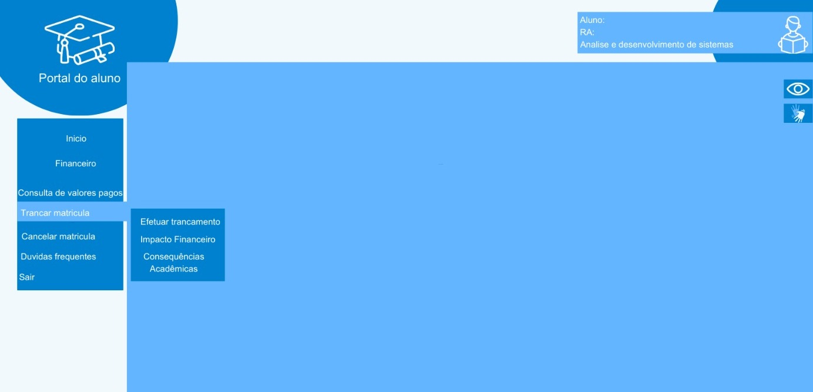
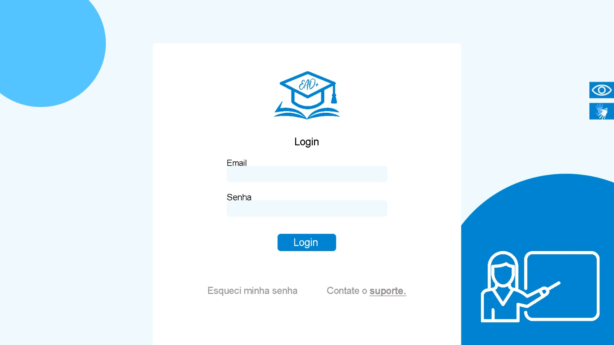
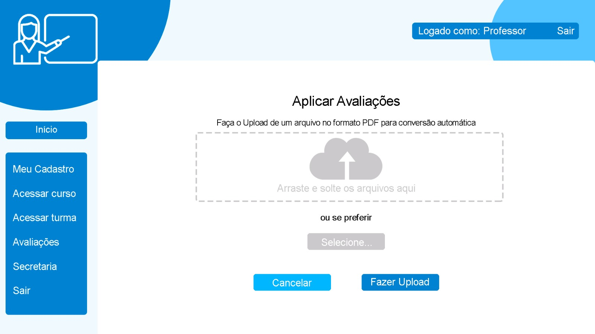
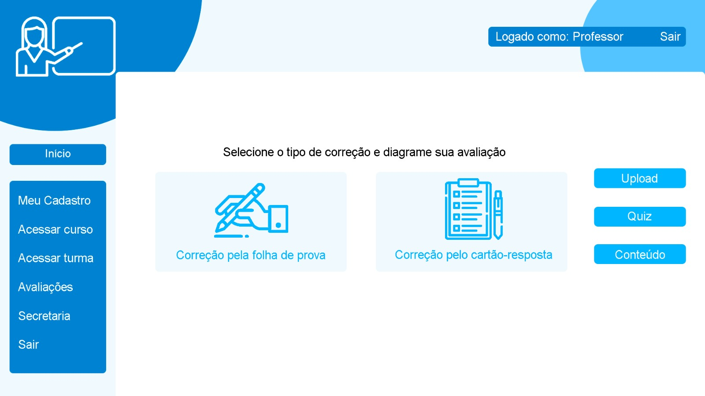
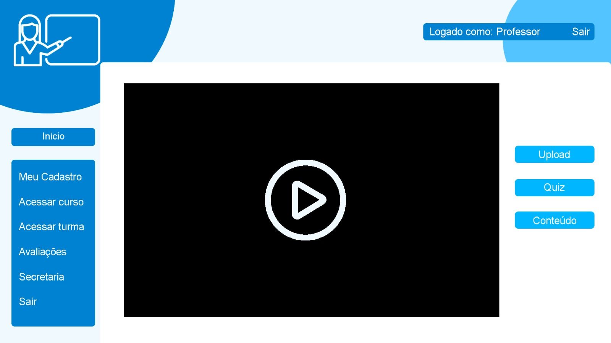
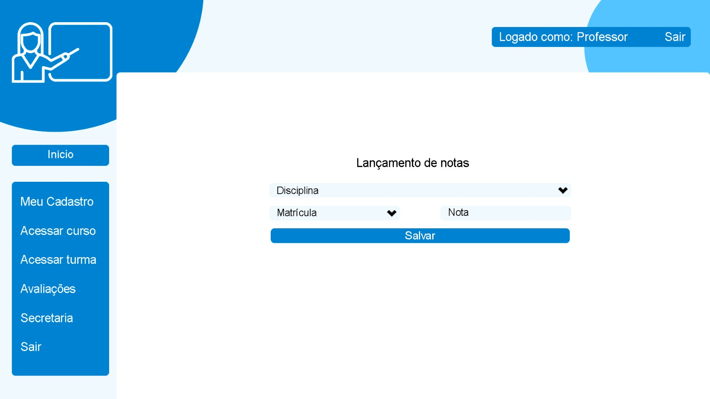
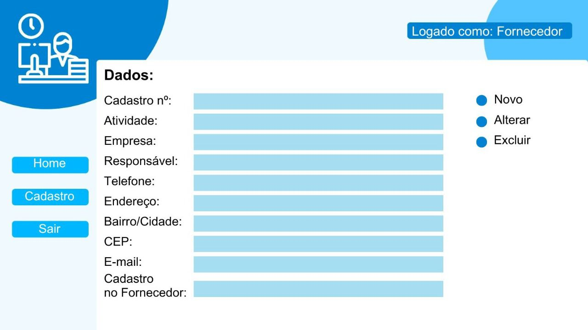

# Plataforma de Ensino
Trabalho desenvolvido como parte da obtenção de nota da faculdade. Disciplina Projeto Integrador III, SENAC.

## Integrantes:
- BRUNO DA SILVIA JESUINO
- EDUARDO LUIZ ANESIO 
- LUCAS ROCHA DA COSTA 
- PEDRO HENRIQUE MARQUES DE ALCANTARA 
- RAFAEL LUNA DE OLIVEIRA PEREIRA 
- TALITA DE ALMEIDA CARVALHO 

## Descrição/ Objetivo
O trabalho desenvolvido consiste em apresentar uma plataforma de uma instituição de graduação EAD que inclui a estrutura organizacional, o fluxo de informações, os processos de matrícula, a interação aluno-instituição, entre outros. 

## Caso de Uso
Relacionamento Aluno, Professor e Fornecedor.

## Diagrama de Classe
Diagrama de classe de gestão da plataforma EAD.

# Telas
As tela foram desenvolvidas na plataforma Canva.

# Protótipo das telas
## Aluno
- ### 1. Cadastro Aluno na Plataforma.

 
 
- ### 2. Login do Aluno

 
 
 
- ### 3. Acesso ao Portal do Aluno

 
 
- ### 4. Acesso ao Curso

 
 
- ### 5. Acesso as Notas

 
 
- ### 6. Acesso às Informações Acadêmicas

 
 
- ### 7. Trancamento da Matrícula

## Professor
- ### 1. Login do Professor

- ### 2. Aplicar Avaliações

- ### 3. Corrigir Avaliações

- ### 4. Lançar Conteúdo

- ### 5. Lançar Notas

## Fornecedor
- ### 1. Login do Fornecedor

- ### 2. Cadastro do Fornecedor
